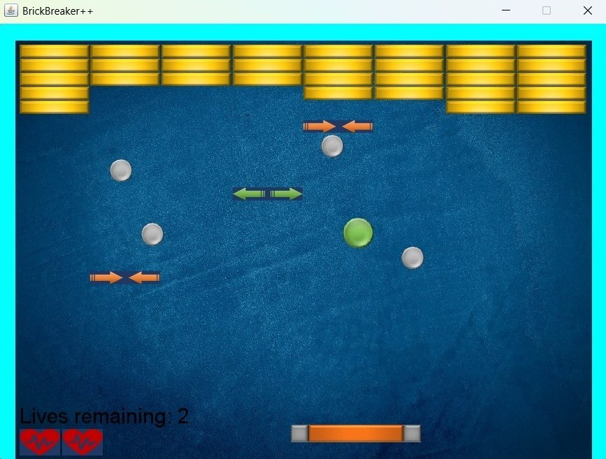

# BrickBreaker++: A Modern Take on the Classic Arkanoid Game

## Overview

This project is a modern take on the classic "Arkanoid" game, implemented using Java and the `DanoGameLab`
game engine, a lightweight Java-based framework designed for rapid 2D game development. The game challenges
players to control a paddle and break bricks using a ball, with additional mechanics to enhance gameplay. The
project showcases object-oriented design principles and advanced programming patterns.

## Table of Contents

1. [Overview](#overview)
2. [Game Description](#game-description)
3. [Key Features](#key-features)
4. [Code Structure and Key Components](#code-structure-and-key-components)
   - [Packages](#packages)
       - [`brick_strategies`](#brick_strategies)
       - [`gameobjects`](#gameobjects)
   - [Key Classes](#key-classes)
       - [`BrickerGameManager`](#brickergamemanager)
       - [`CollisionStrategy` (Interface)](#collisionstrategy-interface)
       - [`Ball`](#ball)
       - [`Paddle`](#paddle)
       - [`Brick`](#brick)
       - [Life Counters](#life-counters)
       - [Additional Components](#additional-components)
5. [How to Run](#how-to-run)
   - [Steps to Run](#steps-to-run)
   - [Game Instructions](#game-instructions)
       - [Controls](#controls)
       - [Gameplay Mechanics](#gameplay-mechanics)

## Game Description

Players control a paddle to direct a ball, aiming to break all bricks on the screen. The game includes unique
features such as:

- Additional paddles or balls introduced during gameplay.
- Dynamic changes to the game camera.
- Modifications to paddle or ball size.
- Visual and numeric life counters.

The game concludes when all bricks are destroyed, or the player loses all lives.

## Key Features

- **Object-Oriented Design**: Utilizes classes and interfaces to encapsulate behavior and structure.
- **Design Patterns**:
    - **Decorator Pattern**: Extends brick collision behaviors dynamically.
    - **Factory Pattern**: Centralized creation of collision strategies.
- **Game Engine Integration**: Built on the `DanoGameLab` engine, leveraging its features for rendering,
  collision detection, and sound.
- **Collision Management**: Abstracts collision behaviors using the `CollisionStrategy` interface.
- **Scalability**: Modular design facilitates adding new features or mechanics.

## Code Structure and Key Components

### Packages

#### `brick_strategies`
- Contains logic for handling brick collisions, utilizing design patterns like the decorator and factory 
  patterns.

#### `gameobjects`
- Defines core game elements such as the ball, paddle, bricks, and life counters.

### Key Classes

#### `BrickerGameManager`

- The main class that initializes and manages the game.
- Coordinate objects, updates game state, and integrates the game engine.

#### `CollisionStrategy` (Interface)

- Abstracts collision behavior for bricks.
- Key implementations include:
    - **`RemoveBrickStrategy`**: Removes bricks upon collision.
    - **`AddPaddleStrategy`**: Adds an extra paddle during gameplay.
    - **`ChangeCameraStrategy`**: Modifies the game camera dynamically.

#### `Ball`

- Represents the game ball, tracking its collisions and playing sound effects on impact.

#### `Paddle`

- The main player-controlled object, responding to user inputs.

#### `Brick`

- Represents breakable bricks with various behaviors depending on the collision strategy.

#### Life Counters

- **`GraphicLifeCounter`**: Displays remaining lives graphically.
- **`NumericLifeCounter`**: Displays remaining lives numerically.

#### Additional Components

- **`Puck`**: A secondary ball-like object with unique behavior.
- **`RemoveBrickStrategyDecorator`**: Enhances collision strategies using the decorator pattern.

## How to Run

### Steps to Run

1. **Ensure Java Installation**: Ensure you have Java installed on your system.
2. **Compile**: Compile the project using any Java-compatible IDE or CLI tools.
3. **Run**: Run the `BrickerGameManager` class to start the game.

### Game Instructions

#### Controls
- **Left/Right Arrow**: Move the paddle left or right.

#### Gameplay Mechanics

- **Brick Destruction**: The ball breaks bricks upon collision. Each collision may trigger special events
  or effects, such as adding paddles or spawning additional balls.
- **Winning Condition**: Break all bricks to win the game.
- **Losing Condition**: Lose all lives (tracked by life counters) if the ball falls off the screen.
- **Special Features**: Some bricks may trigger dynamic changes like camera shifts, paddle resizing, or
  introducing new pucks/balls.
